<div align="center">


# Advanced Workbench · 进阶工作台

**Five monetizable skills — web development, foreign trade, personal brand, AI monetization and video production — packaged into one offline study library with roadmaps, curated resources, real projects and downloadable materials.**

Runs fully offline · Double-click to start · Single-instance · Lives in the system tray

[](LICENSE)
[](#quick-start)
[](package.json)
[](package.json)
[](#what-is-this)

[English](README.en.md) · [简体中文](README.md)

[What is this](#what-is-this) · [Screenshots](#screenshots) · [Quick start](#quick-start) ·
[Export formats](#export-formats) · [Project layout](#project-layout) · [Customizing](#customizing)

</div>

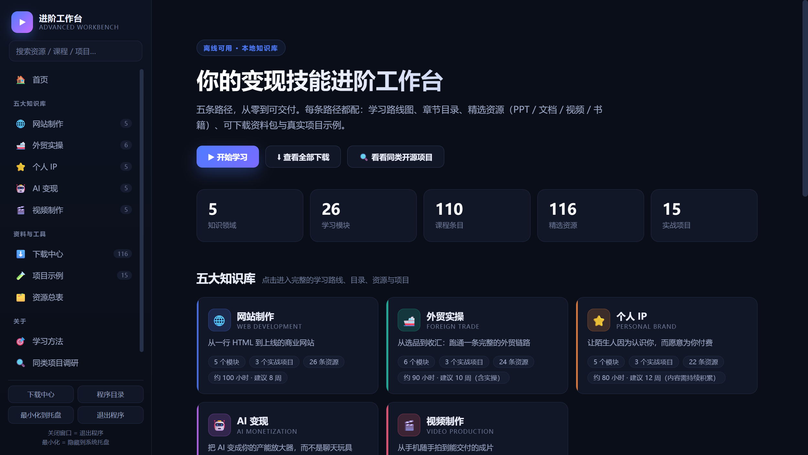

## What is this

A **Windows desktop application** that turns "learn a skill and make money with it" into
five step-by-step paths. Every path ships with a **learning roadmap, a table of contents,
curated resources, hands-on projects and self-check lists**.

It is not yet another note-taking shell — it is **a finished product with the content already inside**.
Open it and start studying; when you are done, export everything to PDF / PPTX / Markdown / HTML / CSV
and take it with you.

| | |
| --- | --- |
| **5** knowledge areas | Web development · Foreign trade · Personal brand · AI monetization · Video production |
| **26** learning modules | Each with a suggested duration and a concrete deliverable |
| **110** lessons | Ordered and dependency-aware, not just a list |
| **116** curated resources | PPT / document / video / book, with difficulty and provider |
| **15** hands-on projects | Goals, tech stack, steps, deliverables and downloadable templates |
| **0** runtime dependencies | The entire export engine is hand-written, nothing extra to install |

> **In one line**: from "I want to learn something" to "I can deliver my first paid job" —
> this workbench lays the road in between.
---

## Screenshots

### Demo

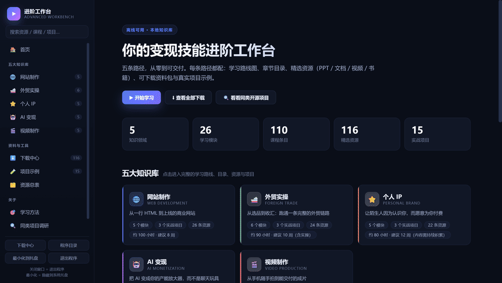

### Home

An overview of the five knowledge areas: key numbers, five path cards, the learning route and the entry point.


### Knowledge area detail

Using *Web Development* as the example: goals, capability checklist, roadmap, full table of contents,
curated resources, hands-on projects, self-check list, FAQ and downloads — nine sections on one page.

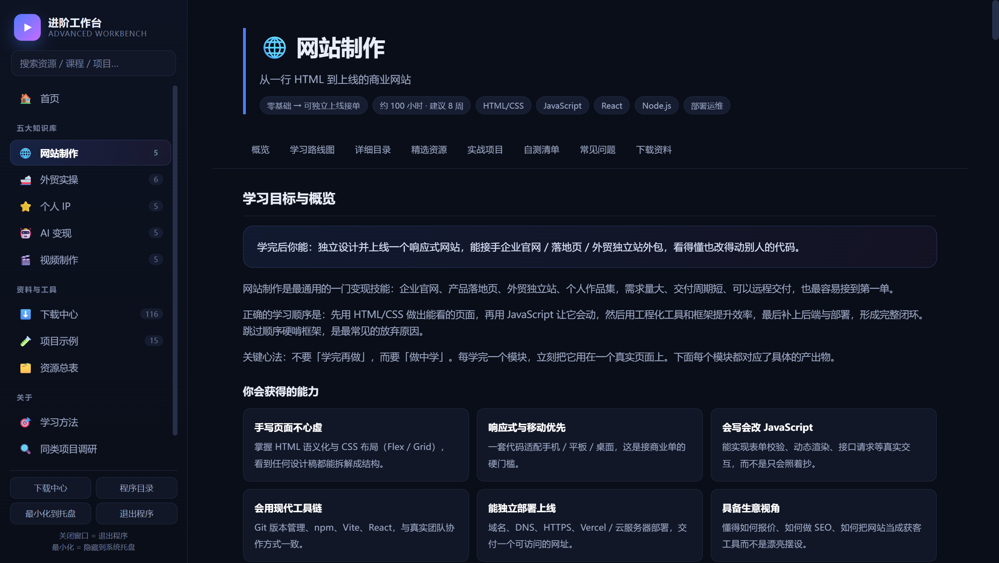

<table>
<tr>
<td width="50%">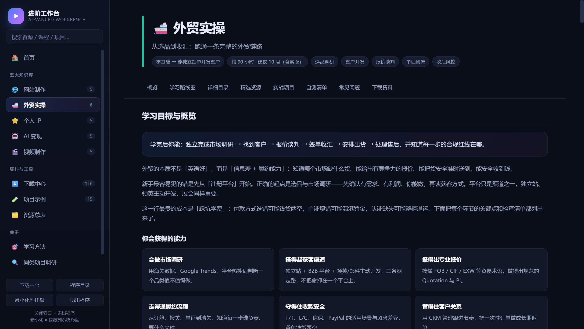<br/><sub><b>Foreign trade</b> · sourcing → leads → quotation → payment</sub></td>
<td width="50%">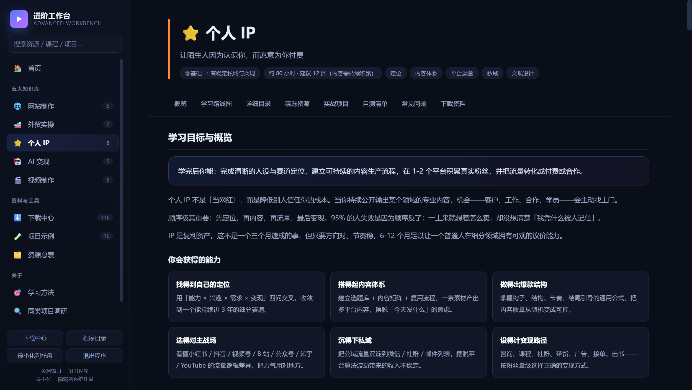<br/><sub><b>Personal brand</b> · positioning → content → trust → revenue</sub></td>
</tr>
<tr>
<td width="50%">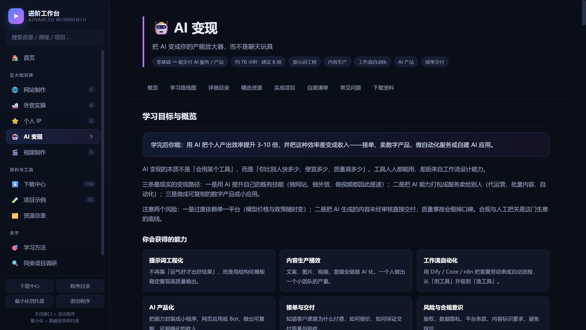<br/><sub><b>AI monetization</b> · turn AI into a capacity multiplier</sub></td>
<td width="50%">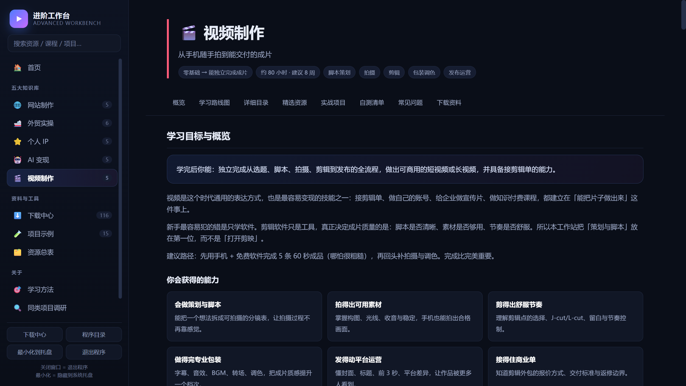<br/><sub><b>Video production</b> · from phone footage to a deliverable cut</sub></td>
</tr>
</table>

### Download centre / Projects / Resource index

<table>
<tr>
<td width="50%">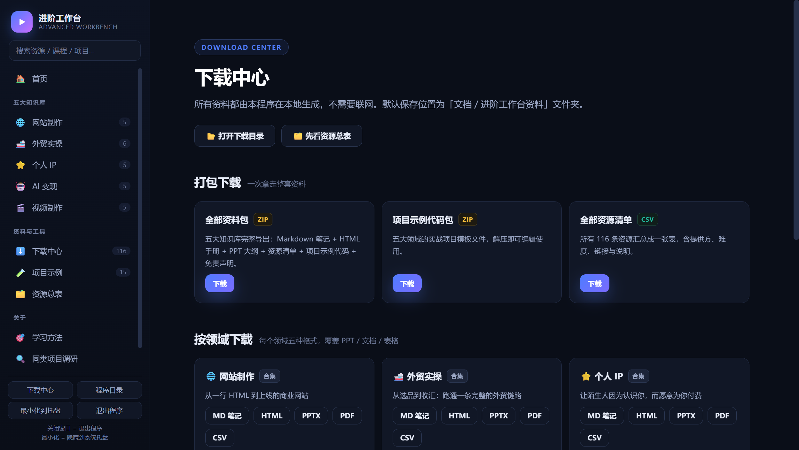<br/><sub><b>Download centre</b> · generate every material in one click</sub></td>
<td width="50%">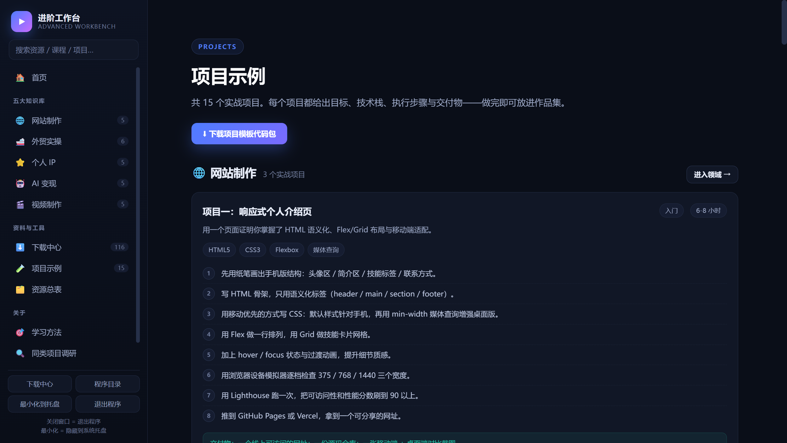<br/><sub><b>Projects</b> · 15 hands-on projects</sub></td>
</tr>
<tr>
<td width="50%">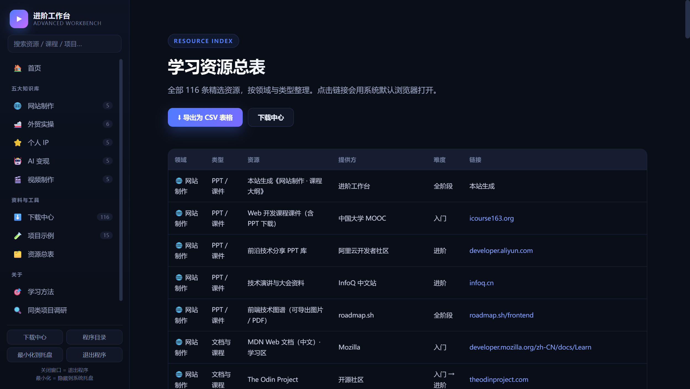<br/><sub><b>Resource index</b> · 116 filterable resources</sub></td>
<td width="50%">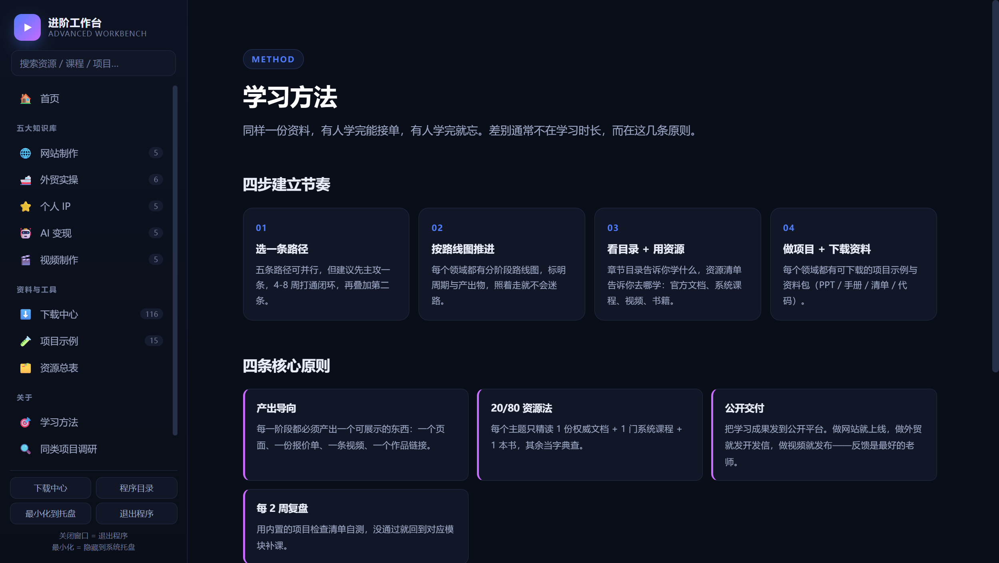<br/><sub><b>Learning method</b> · four output-driven principles</sub></td>
</tr>
</table>

<details>
<summary><b>More screenshots (prior-art research / about)</b></summary>

<br/>

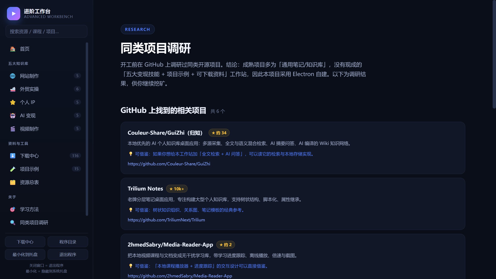

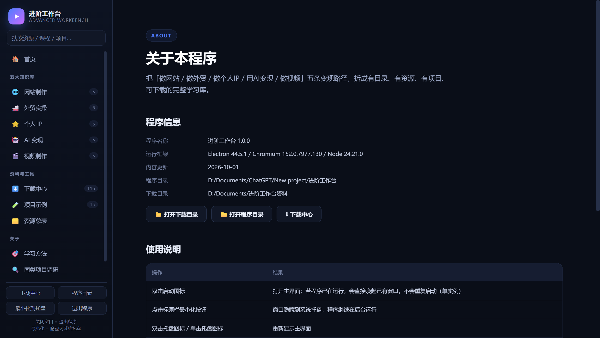

</details>
---

## Quick start

> The UI is in Chinese. Everything below is the launcher workflow.

### 1. First run (needs the internet once)

Double-click **`首次安装依赖.bat`** and wait for the "正在启动进阶工作台" message.
It installs the Electron runtime automatically (roughly 1–3 minutes) and then opens the window.

> When the network is restricted, the script falls back to the npmmirror CDN automatically.

### 2. Daily start

Double-click **`启动进阶工作台.vbs`** — it starts silently with no console window.

You can also use **`启动进阶工作台.bat`**, which shows a console window and will
auto-install missing dependencies.

### 3. Desktop shortcut

A **「进阶工作台」** shortcut with the app icon is placed on your desktop.

If it gets deleted, create one manually (right-click → New → Shortcut):

| Field | Value |
| --- | --- |
| Target | `C:\Windows\System32\wscript.exe` |
| Arguments | `"<install dir>\启动进阶工作台.vbs"` |
| Start in | `<install dir>` |
| Icon | `<install dir>\build\icon.ico` |

---

## App behaviour

| Action | Result |
| --- | --- |
| **Double-click the icon** | Opens the main window |
| **Double-click again** | **No second instance.** The existing window is restored and focused |
| **Click "Minimize"** | Window hides to the **system tray**, the app keeps running |
| **Click the window's close button** | **Fully exits** the app (the tray icon disappears too) |
| **Tray icon** | Click / double-click → restore the window; right-click → menu (show window / open download folder / open program folder / about / **quit**) |

Two buttons also live at the bottom-left of the UI: **minimize to tray** and **quit**.

> Rule of thumb: **minimize = hide to tray, close = quit the app.**

---

## The five knowledge areas

| # | Area | One-line goal | Modules | Projects | Resources |
| --- | --- | --- | --- | --- | --- |
| 01 | 🌐 **Web development** | From one line of HTML to a live commercial website | 5 | 3 | 26 |
| 02 | 📊 **Foreign trade** | Run a complete trade loop, from sourcing to getting paid | 6 | 3 | 24 |
| 03 | ⭐ **Personal brand** | Make strangers pay you because they know you | 5 | 3 | 22 |
| 04 | 🤖 **AI monetization** | Make AI a capacity multiplier, not a chat toy | 5 | 3 | 22 |
| 05 | 🎬 **Video production** | From phone footage to a deliverable edit | 5 | 3 | 22 |

Total: **26 learning modules / 110 lessons / 116 curated resources / 15 hands-on projects**.

Each area contains: goals, a staged roadmap (with duration and deliverables), a table of contents,
curated resources (PPT / document / video / book), hands-on projects, a self-check list and an FAQ.
---

## Export formats

The app includes a **download centre**. Files are **generated on the fly** (not shipped as
static assets), so exports always match the current content.

| Export | Format | Notes |
| --- | --- | --- |
| Single area · study handbook | **PDF** | Complete handbook, ready to print or share |
| Single area · course outline | **PPTX** | 16 slides, recolour it and use it as your own deck |
| Single area · study handbook | **Markdown** | Easy to re-edit or import into a notes app |
| Single area · study handbook | **HTML** | Single-file page, double-click to read in a browser |
| Single area · resource list | **CSV** | Opens straight in Excel, easy to filter and tick off |
| **Full resource index** | **CSV** | All 116 resources across the five areas in one sheet |
| **Full material pack** | **ZIP** | Handbooks / outlines / lists for all areas + every project |
| **Project template pack** | **ZIP** | Runnable templates and checklists for all 15 projects |

**Where it saves**: you pick the location in a dialog. The default is
`Documents\进阶工作台资料\` (the tray menu's "open download folder" jumps straight there).

> Markdown and CSV are written in proper UTF-8 (with or without BOM as appropriate),
> so Excel and note-taking apps show Chinese text correctly.

---

## Navigation

| Page | Contents |
| --- | --- |
| **Home** | Overview of the five areas + key numbers |
| **Knowledge areas** | Detail page per area (goals / roadmap / TOC / resources / projects / self-check / FAQ) |
| **Download centre** | Every export above, generated in one click |
| **Projects** | 15 hands-on projects with goals, stack, steps and deliverables |
| **Resource index** | 116 resources, filterable by type / area / difficulty |
| **Learning method** | Output-driven study, the 20/80 resource rule, public delivery, two-week reviews |
| **Prior-art research** | Survey of comparable open-source projects on GitHub |
| **About** | Version info, program folder, download folder |

The search box at the top does **full-text search across all areas** — lessons, resources,
projects and FAQs in one pass.
---

## Project layout

```
进阶工作台/
├─ main.js                  Electron main process: window / tray / single instance / IPC
├─ preload.js               contextBridge (the renderer only gets whitelisted APIs)
├─ src/
│  ├─ index.html            App shell
│  ├─ css/style.css         Theme and layout
│  └─ js/app.js             Renderer: routing / rendering / search / export wiring
├─ lib/
│  ├─ exporter.js           PDF / HTML / Markdown / CSV generation
│  ├─ pptx.js               Hand-written PPTX (OOXML) writer
│  ├─ zip.js                Hand-written ZIP (crc32 + deflateRaw)
│  └─ icon.js               Hand-written PNG / ICO encoder
├─ content/                 ★ All course content lives here
│  ├─ site.json             Site info / learning method / research / disclaimer
│  ├─ cat-website.json      The five knowledge areas
│  ├─ cat-trade.json
│  ├─ cat-personalip.json
│  ├─ cat-aimoney.json
│  ├─ cat-video.json
│  └─ projects/             Downloadable templates for the 15 projects
├─ build/                   Icons (generated on first run)
├─ docs/                    Screenshots and demo GIF for this README
├─ 启动进阶工作台.vbs        Daily launcher (silent)
├─ 启动进阶工作台.bat        Launcher with console, auto-installs dependencies
└─ 首次安装依赖.bat          Installs the Electron runtime
```

---

## Customizing

### 1. Change the course content

**No code required.** Edit `content/cat-*.json` and the sidebar, home statistics,
exported materials and resource index all stay in sync automatically.

### 2. Add a project template

1. Drop the template files into `content/projects/<area-id>/`
2. Add an entry to `projects[]` in that area's JSON

The "project template pack" export picks it up automatically.

### 3. Change site-level info

`content/site.json` drives the home headline, learning method, prior-art research and disclaimer.

### 4. Run from source

```bash
npm install     # only one devDependency: electron
npm start
```

Build a portable exe:

```bash
npm run dist    # electron-builder --win portable
```

> The renderer follows `contextIsolation: true` / `nodeIntegration: false`.
> Any new capability must be exposed explicitly in `preload.js` and implemented as an IPC handler in `main.js`.
---

## Technical notes

- **Electron 44** (Chromium + Node) with `contextIsolation: true` and `nodeIntegration: false`.
  The renderer talks to the main process only through the whitelisted `contextBridge` API in `preload.js`.
- **Single instance**: `app.requestSingleInstanceLock()`. A second launch exits immediately and the
  `second-instance` event restores and focuses the existing window.
- **Tray**: the `minimize` event is intercepted and turned into `hide()`; the `close` event is allowed
  through, so closing really quits.
- **The export engine is entirely hand-written, with zero runtime dependencies**:
  - `lib/pptx.js` assembles OOXML directly (`[Content_Types].xml` + slide + layout + master + theme)
    to produce a working 16-slide `.pptx`
  - `lib/zip.js` implements ZIP itself (crc32 + `zlib.deflateRawSync`)
  - `lib/icon.js` implements a PNG encoder (zlib + crc32 + IDAT chunking) and an `.ico` wrapper
    (embedding 16/32/48/64/128/256 px variants)
  - PDF goes through Electron's built-in `printToPDF`, reusing **a single hidden window**
    (creating a new one per export caused the second export to fail)
- `package.json` has exactly one devDependency, `electron`. **There is no build step — the source is the app.**

---

## Prior-art research

Before starting, I surveyed the field: mature open-source options are mostly **generic notes / knowledge
bases**, and nothing existed that combined "five monetizable skills + roadmaps + project templates +
downloadable materials" — hence this project. The full survey is in the app's "prior-art research" page;
an excerpt:

| Project | Stars | What is worth borrowing |
| --- | --- | --- |
| [Couleur-Share/GuiZhi](https://github.com/Couleur-Share/GuiZhi) | ~34 | Local-first AI knowledge base; retrieval and local storage |
| [TriliumNext/Trilium](https://github.com/TriliumNext/Trilium) | 10k+ | Tree-shaped knowledge organisation, templates, relation graph |
| [2hmedSabry/Media-Reader-App](https://github.com/2hmedSabry/Media-Reader-App) | ~2 | Offline course player with progress tracking |
| [wang-zilei/Memora](https://github.com/wang-zilei/Memora) | ~2 | Tauri approach (lighter on memory than Electron) |
| [zhoushu44/LLM-Wiki-Pro](https://github.com/zhoushu44/LLM-Wiki-Pro) | ~1 | "Compile knowledge" instead of retrieving it every time |
| [ourafrica/our-africa-desktop](https://github.com/ourafrica/our-africa-desktop) | 0 | Data model for an offline LMS |
---

## FAQ

**Nothing happens when I double-click?**
Run `首次安装依赖.bat` first to install the runtime. If it still does nothing, install
[Node.js 20+](https://nodejs.org/) and run `npm install` in the program folder.

**Downloading Electron fails?**
Use `启动进阶工作台.bat` — it has the npmmirror CDN baked in.

**The window disappeared after I clicked minimize?**
That is by design — it is hidden in the system tray at the bottom-right. Click the tray icon to restore it.

**There is still a process in Task Manager — did it not close?**
Clicking the window's close button, or "quit" in the tray menu, terminates the process completely.
Only **minimizing** keeps a background process alive.

**The exported PPTX will not open?**
Use PowerPoint 2016+, WPS or LibreOffice Impress. It is standard OOXML (16 slides).

**Can I change the content?**
Yes — see [Customizing](#customizing). Edit the JSON under `content/`; no code changes needed.

**I edited a launcher script and now Windows reports an invalid character?**
`启动进阶工作台.vbs` must be saved as **UTF-16LE** (Notepad's "Unicode") or ANSI —
**not UTF-8 with BOM**, which Windows Script Host cannot parse. The two `.bat` files are the
opposite: they must be **UTF-8 without BOM** (together with the `chcp 65001` line inside them)
for Chinese text to display correctly. Also, paths passed to the program inside the `.bat`
must be written as `"%~dp0."` rather than `"%~dp0"`, because `%~dp0` ends with a backslash
that escapes the following quote and breaks path parsing.

---

## Disclaimer

The content here is study methodology and a resource index. It is not investment, legal, tax or
trade-compliance advice. For foreign-trade licensing, foreign exchange, export tax rebates and
customs declarations, follow the latest rules from China's Ministry of Commerce, General Administration
of Customs, State Administration of Foreign Exchange and your local authorities.
All external links point to publicly accessible official sites or platform home pages; their content
and availability are provided by third parties. Please respect each platform's terms of service and
copyright, and obtain permission before republishing or using anything commercially.

---

## License

[MIT](LICENSE) © 2026 Advanced Workbench · 进阶工作台

<div align="center">
<br/>
<sub>If this project helps you, a ⭐ Star is appreciated</sub>
</div>